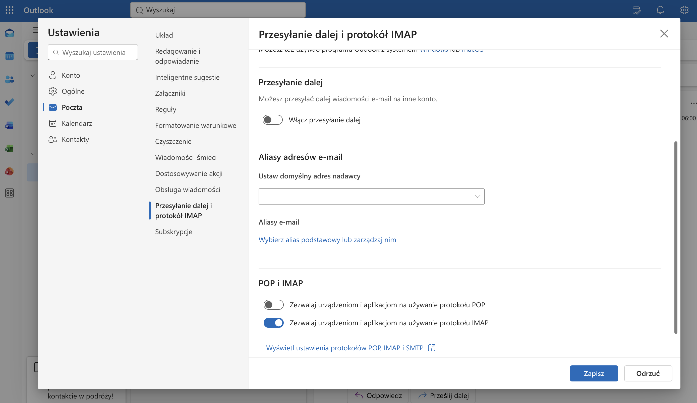
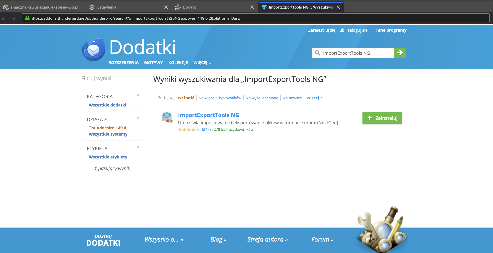

# 📥 Thunderbird Email Acquisition (Outlook.com)

This module demonstrates the forensic acquisition of **Outlook.com / Office 365** webmail. Using Thunderbird on macOS allows for a seamless transition from Microsoft’s proprietary cloud environment to a standardized, local **MBOX** storage for offline analysis.

---

## 🛠️ Forensic Toolkit
* **Primary Tool:** Mozilla Thunderbird (macOS build)
* **Auth Method:** `OAuth2` (Mandatory for Microsoft modern authentication)
* **Primary Artifact:** `MBOX` (Berkeley Mailbox)
* **Alternative Artifact:** `PST` (via Outlook Web Export)
* **Server:** `outlook.office365.com` (IMAP)

---

## 📁 Investigation Roadmap

### Phase 1: Native Cloud Export (Provider-Side)
For cases where third-party tools cannot be installed, use the native Microsoft export options:

* **Full PST Export:** Navigate to `Settings` > `General` > `Privacy and Data`. Select **Export Mailbox**.

    * *Forensic Note:* This generates a full mailbox backup. Filtering by specific criteria is not possible during export; the entire dataset must be parsed later.     
* **Targeted PDF Print:** For individual high-value messages, use the "Print to PDF" function within the web interface to secure immediate evidence of specific communications.

### Phase 2: Thunderbird Configuration & OAuth2
* **OAuth2 Handshake:** Unlike standard IMAP setups, Outlook requires web-based token authentication to bypass MFA/2FA.

 
  
* **Folder Mapping:** Verification of special IMAP folders (e.g., `Sent Items` vs `Sent`) to ensure no sub-directories are excluded from the sync.

### Phase 3: Advanced Filtering & Triage
To isolate specific evidence (e.g., communications from a specific company or date range):

* **Advanced Search:** Use `Ctrl + Shift + F` (or `Cmd + Shift + F` on Mac) to filter by:
    * **Sender:** `from:domain.com`
    * **Date Range:** `received:2023-01-01..2023-12-31`
* **Targeted Export:** Using the **ImportExportTools NG** add-on, selected messages can be exported as individual `.EML` files or compiled `PDFs` for reporting.

   

### Phase 4: Full Data Sync & Validation
* **Full Acquisition:** Toggling the network status to trigger the **"Pobierz wiadomości" (Download)** prompt for complete local caching.
* **MBOX Validation:** Verifying that Microsoft’s proprietary cloud data has been correctly encapsulated into local MBOX files within the macOS Profile directory (`~/Library/Thunderbird/Profiles/`).

---

## ⚠️ DFIR Best Practices (Outlook Specific)

* **Sync Latency:** Outlook/O365 may enforce lower rate limits for IMAP compared to other providers. Large mailboxes should be synchronized in stages to prevent connection resets or data gaps.
* **Metadata Integrity:** Be aware that Outlook-specific metadata (e.g., "Categories", "Importance", or "Read Receipts") is stored in custom **X-headers** within the resulting MBOX file.
* **Evidence Persistence:** Moving messages to an "Archive" folder within the UI organizes the data but does not protect against account deletion. Only a verified local export (MBOX/EML) ensures long-term evidence preservation.

> [!TIP]
> **Pro-Tip for Fast Triage:**
> If time is limited, use the search bar to filter by `@company_domain.com`. Once isolated, move these messages to a dedicated local sub-folder in Thunderbird before initiating the final export. This minimizes the forensic footprint by focusing only on relevant artifacts.
